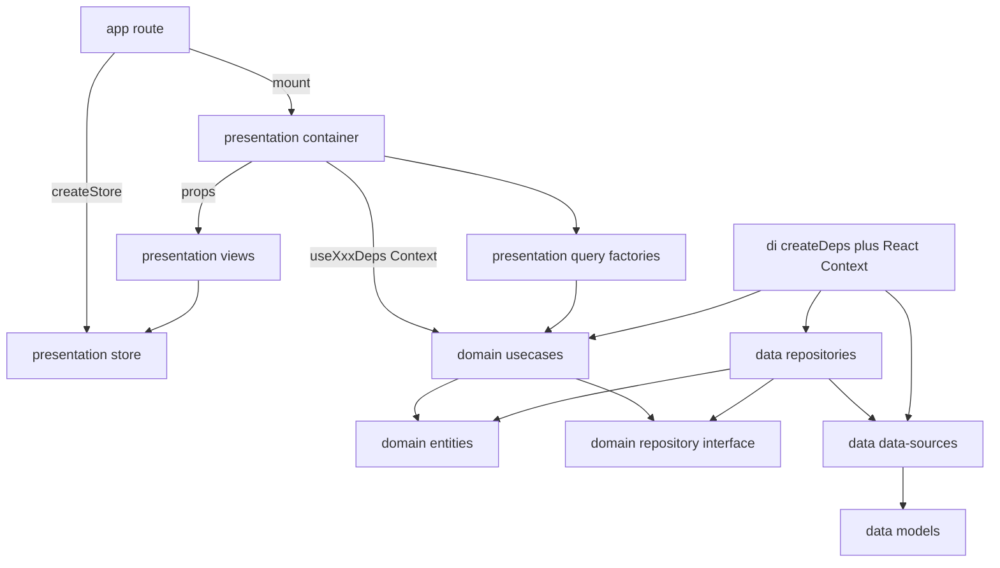
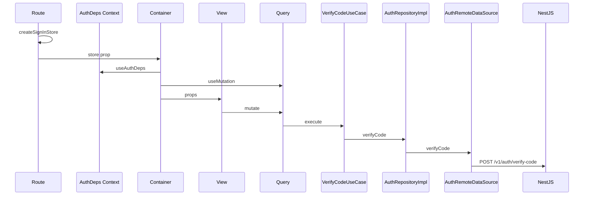

<!-- 4f1cd911-e07c-4ce5-979e-a0f6df482ecf -->
---
todos:
  - id: "bootstrap-composition"
    content: "Свести SPA bootstrap: createAppDeps() + Router context + React AppDepsProvider/срезовые провайдеры, без locator"
    status: pending
  - id: "core-http-query"
    content: "core: HttpClient, TokenStorage, QueryClient, Deps context primitives — без знания доменов"
    status: pending
  - id: "domain-auth-feature-signin"
    content: "domains/auth (data/di/domain, use cases на каждый метод) + features/sign-in (store factory, query factories, container, views). Роут только инжектит store и монтирует container"
    status: pending
  - id: "domain-tasks-feature-list"
    content: "domains/tasks: только remote data-source + repo impl + ListTasksUseCase; features/task-list container; protected loader через GetSessionUseCase"
    status: pending
  - id: "eslint-boundaries"
    content: "ESLint boundaries: внешние слои + внутренние (presentation↛data, container↛views наоборот ок, views↛container/di/data); только barrel-импорты"
    status: pending
isProject: false
---
# Архитектура фронта: слои среза, use cases, Context, container

Проектируем **крупную** систему: слои и use cases не экономим «на потом». `apps/web` — пустой TanStack Router SPA. Снаружи `app` / `core` / `domains` / `features`. Внутри среза — `data` / `di` / `domain` / `presentation` (можно добавить mapper, constants, config, **container**).

## Внешние слои

```
src/
  app/        # composition root: createAppDeps, провайдеры, routes
  core/       # HttpClient, QueryClient, env, ui-kit, примитив Deps context
  domains/    # общие bounded contexts (auth, tasks, …)
  features/   # экраны; всегда presentation; data/domain — если экран владеет своей логикой
```

- **app** собирает граф зависимостей и монтирует экран. В loader берёт **use case** из deps (префетч). В компоненте роута создаёт per-mount store и рендерит **container**. Не вызывает `useQuery` / `useMutation`.
- **core** не знает срезы.
- **domains** — общие контексты. Импорт другого домена только через его `domain` barrel. Циклов нет.
- **features** не импортируют друг друга. Не ходят в data. Use cases читают из Context (или получают пропсами от роута).

## Внутренние слои среза

```
<slice>/
  data/
    data-sources/     # внешний мир фичи: remote HTTP, local storage, … — только то, что есть
    models/           # DTO запросов/ответов и модели локального хранения
    repositories/     # impl доменного репозитория: data-sources + маппинг model → entity
    index.ts
  di/
    create-deps.ts    # склеивает data-sources → repo impl → use cases; возвращает typed AuthDeps
    context.ts        # React Context + Provider + useAuthDeps
    index.ts
  domain/
    entities/
    repositories/     # интерфейс, не impl
    usecases/         # по одному на метод репозитория (и на оркестрацию нескольких)
    index.ts          # entities + use cases — контракт для presentation и других доменов
  presentation/
    query/            # или store / store-query: createStore, query/mutation factories
    container/        # биндинг React-состояния: useQuery/useMutation, observer
    views/            # глупые компоненты, только пропсы
    ui/
    index.ts          # createStore, container, (views не обязательны снаружи)
  index.ts
```

Data-source **не обязан** иметь и remote, и local. Он описывает, как срез общается с внешним миром. Только API — один remote + http-клиент. Local появляется, когда появляется локальное хранение (токены). Основной репозиторий: интерфейс в `domain`, impl в `data`.

**Use case обязателен на каждый метод**, даже в одну строку. Presentation и loaders не импортируют репозиторий и не видят data. Однострочник — намеренный шов: позже сюда же кладётся склейка нескольких репозиториев и маппинг в entity, без переписывания container/view.

Слой не создаём, только если в нём буквально нечего класть (нет local — нет local data-source). Use cases и доменный репозиторий не пропускаем.



Зависимости внутри среза:

- **views** → store-типы, `ui`, пропсы. Нет Context, нет `new Store()`, нет domain use cases, нет data.
- **container** → Context/deps (use cases), query factories, store, views. Нет data, нет репозитория.
- **query factories** → типы use cases / entities как аргументы.
- **domain** → ни data, ни presentation, ни di.
- **data** → domain (impl порта, возврат entities).
- **di** → data + domain. Единственное место, где видны конкретные data-source и repository impl.

Между срезами — только barrel слоя. В глубину чужого среза не лезем.

## Barrel-файлы

- `domain/index.ts` — entities + use cases.
- `data/index.ts` — impl и data-sources; импортирует только `di` этого среза.
- `di/index.ts` — `createXxxDeps`, `XxxDepsProvider`, `useXxxDeps`. Импортирует `app` (и тесты).
- `presentation/index.ts` — `createXxxStore`, container.
- `<slice>/index.ts` — di public API + presentation public API.

## Состояние

- Сервер — TanStack Query в `presentation/query`. `queryFn` / `mutationFn` зовут `useCase.execute()`, не репозиторий.
- Эфемерный UI — MobX store фичи, per-mount, не в Context как синглтон.
- Токены — local data-source, если он есть.
- URL — search params роутера.
- В Query cache и во view — domain entity, не DTO.

## DI: фабрики среза + React Context, без локатора

Нет GetIt, нет `resolve(TOKEN)`, нет `useInject`. Граф собирается явно в `createXxxDeps` и отдаётся дереву через Context. Для loaders тот же объект лежит в TanStack Router `context` — loader не умеет читать React Context.

```ts
// domains/auth/di/create-deps.ts
export type AuthDeps = {
  sendCode: SendCodeUseCase
  verifyCode: VerifyCodeUseCase
  getSession: GetSessionUseCase
}

export function createAuthDeps(http: HttpClient, tokenStorage: TokenStorage): AuthDeps {
  const remote = new AuthRemoteDataSource(http)
  const local = new AuthLocalDataSource(tokenStorage)
  const repo = new AuthRepositoryImpl(remote, local)
  return {
    sendCode: new SendCodeUseCase(repo),
    verifyCode: new VerifyCodeUseCase(repo),
    getSession: new GetSessionUseCase(repo),
  }
}

// domains/auth/di/context.ts
const AuthDepsContext = createContext<AuthDeps | null>(null)
export function AuthDepsProvider({ value, children }: { value: AuthDeps; children: ReactNode }) {
  return <AuthDepsContext.Provider value={value}>{children}</AuthDepsContext.Provider>
}
export function useAuthDeps() {
  const deps = use(AuthDepsContext)
  if (!deps) throw new Error('AuthDepsProvider is missing')
  return deps
}
```

Срез с одним remote (tasks) — тот же шаблон, без local:

```ts
export function createTaskDeps(http: HttpClient): TaskDeps {
  const remote = new TasksRemoteDataSource(http)
  const repo = new TasksRepositoryImpl(remote)
  return { listTasks: new ListTasksUseCase(repo), getTask: new GetTaskUseCase(repo) }
}
```

```ts
// app/create-app-deps.ts
export function createAppDeps() {
  const http = new FetchHttpClient(env.apiBaseUrl)
  const tokenStorage = new LocalStorageTokenStorage()
  return {
    auth: createAuthDeps(http, tokenStorage),
    tasks: createTaskDeps(http),
  }
}

// app/create-app.ts
export function createApp() {
  const deps = createAppDeps()
  const queryClient = createQueryClient()
  return createRouter({
    routeTree,
    context: { queryClient, deps },
    Wrap: ({ children }) => (
      <QueryClientProvider client={queryClient}>
        <AuthDepsProvider value={deps.auth}>
          <TaskDepsProvider value={deps.tasks}>{children}</TaskDepsProvider>
        </AuthDepsProvider>
      </QueryClientProvider>
    ),
  })
}
```

В Context кладём **только use cases** (и при необходимости queryClient уже через QueryClientProvider). Репозитории и data-sources наружу не торчат. UI-сторы в Context не кладём.

`useAuthDeps` зовут **container** и **app-роут** (если роуту нужны use cases без container). Views не вызывают.

Loader:

```ts
beforeLoad: async ({ context, location }) => {
  const session = await context.queryClient.ensureQueryData(
    sessionQuery(context.deps.auth.getSession),
  )
  if (!session) throw redirect({ to: '/auth', search: { redirect: location.href } })
}
```

## Пример: auth + sign-in

Бэкенд: [`POST /v1/auth/send-verification-code`](apps/server/src/auth/auth.controller.ts), `verify-code`, `GET /v1/auth/session`.

Auth — общий домен. Sign-in — экран: store, query factories, container, views.

```
domains/auth/
  data/data-sources/auth-remote-data-source.ts
  data/data-sources/auth-local-data-source.ts    # токены; для tasks такого файла нет
  data/models/...
  data/repositories/auth-repository-impl.ts
  di/create-deps.ts
  di/context.ts
  domain/entities/session.ts
  domain/repositories/auth-repository.ts
  domain/usecases/send-code-use-case.ts
  domain/usecases/verify-code-use-case.ts
  domain/usecases/get-session-use-case.ts

features/sign-in/
  presentation/query/sign-in-store.ts
  presentation/query/send-code-mutation.ts
  presentation/query/verify-code-mutation.ts
  presentation/container/sign-in-container.tsx
  presentation/views/sign-in-form.tsx
  presentation/views/email-step.tsx
  presentation/views/code-step.tsx
  presentation/ui/social-buttons.tsx
```

### domain

```ts
export interface AuthRepository {
  sendCode(email: string): Promise<void>
  verifyCode(email: string, code: string): Promise<Tokens>
  getSession(): Promise<Session | null>
}

export class VerifyCodeUseCase {
  constructor(private readonly authRepository: AuthRepository) {}
  execute(email: string, code: string) {
    return this.authRepository.verifyCode(email, code)
  }
}
```

Однострочник допустим. Когда понадобится второй репозиторий или маппинг — меняется только этот класс.

### data

Remote говорит на DTO. Impl репозитория мапит в entity. Local — только если срез реально пишет на диск (токены после verify).

```ts
export class AuthRepositoryImpl implements AuthRepository {
  constructor(
    private readonly remote: AuthRemoteDataSource,
    private readonly local: AuthLocalDataSource,
  ) {}

  async verifyCode(email: string, code: string): Promise<Tokens> {
    const dto = await this.remote.verifyCode({ email, code })
    const tokens = Tokens.fromDto(dto)
    await this.local.saveTokens(dto)
    return tokens
  }
}
```

Tasks: `TasksRepositoryImpl` держит только `TasksRemoteDataSource` и мапит список в `Task[]`.

### presentation: container биндит, view рисует

```ts
export function createSignInStore() {
  return new SignInStore()
}

export const sendCodeMutationOptions = (sendCode: SendCodeUseCase, store: SignInStore) =>
  mutationOptions({
    mutationFn: (email: string) => sendCode.execute(email),
    onSuccess: (_, email) => store.goToCode(email),
  })
```

```tsx
// presentation/container/sign-in-container.tsx
export function SignInContainer({ store }: { store: SignInStore }) {
  const { sendCode, verifyCode } = useAuthDeps()
  const queryClient = useQueryClient()
  const sendCodeMutation = useMutation(sendCodeMutationOptions(sendCode, store))
  const verifyMutation = useMutation(verifyCodeMutationOptions(verifyCode, queryClient))

  return (
    <SignInForm
      store={store}
      sendCodeMutation={sendCodeMutation}
      verifyMutation={verifyMutation}
    />
  )
}

// presentation/views/sign-in-form.tsx
export function SignInForm({ store, sendCodeMutation, verifyMutation }: SignInFormProps) {
  return store.stage === 'email'
    ? <EmailStep store={store} mutation={sendCodeMutation} />
    : <CodeStep store={store} mutation={verifyMutation} />
}
```

### роут только инжектит жизненный цикл экрана

```tsx
// app/routes/auth.tsx
function AuthRoute() {
  const [store] = useState(() => createSignInStore())
  return <SignInContainer store={store} />
}
```

Роут не биндит Query. Container не создаёт store (store живёт с маунтом маршрута, его создаёт app).



## ESLint boundaries

Внешние: `core ↛ domains|features|app`, `domains ↛ features|app`, `features ↛ features`, `app` может всё.

Внутренние: `views ↛ container|di|data`, `container ↛ data`, `domain ↛ data|di|presentation`, `data ↛ presentation|di`. Чужой срез — только barrel.

## Что не делаем

- Service locator / `useInject` / `container.resolve`.
- `useQuery` / `useMutation` в файле роута.
- `useAuthDeps` во view.
- Presentation или loader импортирует репозиторий / data-source.
- UI-стор как синглтон в Context.
- Data model в Query cache или во view.
- Вторая копия серверного стейта в MobX.
- Пропуск use case «потому что одна строка».
- Обязательная пара remote+local, если второго мира нет.

## Порядок внедрения

1. Bootstrap: `createAppDeps`, Router `context.deps`, срезовые `DepsProvider`.
2. `core` http / storage / QueryClient / контекстный примитив.
3. `domains/auth` + `features/sign-in` (container + views) + `/auth`.
4. `domains/tasks` (только remote) + `features/task-list` + protected loader.
5. Boundaries и barrel-импорты.
