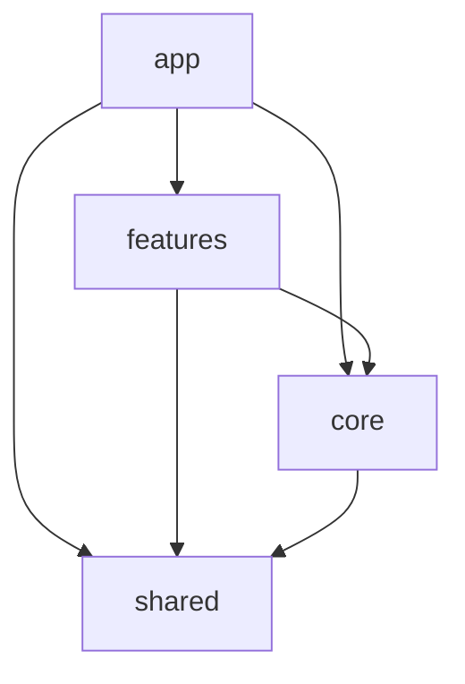

# 05 — Tech

Статус: Draft v0.3 · Обновлено: 2026-08-04

Целевая архитектура. Существующий код в монорепо **не** считается источником истины; при рефакторинге сверяемся с этим документом.

## Стек

| Слой | Выбор |
|------|--------|
| Monorepo | Turborepo + **Bun** (package manager + runtime для скриптов) |
| Web | React + TanStack Start (SSR/SPA hybrid по необходимости) |
| UI | Визуальный язык shadcn-like (токены Realm) · реализация вручную на **Radix / Base UI** примитивах · стили **SCSS Modules** |
| Server | NestJS |
| API | REST (OpenAPI) на старте; WebSocket/SSE для chat/activity later |
| DB | PostgreSQL |
| ORM | **TypeORM** (entities + migrations; репозитории за абстракциями domain services) |
| Cache / ephemeral | Redis (rate limit, email codes) |
| Auth | **Magic Email** (one-time code) + **JWT access / refresh**; revoke — через `User.tokenVersion` (см. [02-domain.md](./02-domain.md)) |
| Validation | **Zod с обеих сторон**: схемы в `packages/shared`, web использует напрямую, Nest — через zod-pipe |
| i18n | Заложить с v1 (RU primary для автора; EN-ready keys) |

### ORM: правила использования TypeORM

- Схема — через entities, изменения — **только миграциями** (`migration:generate` + ревью SQL), без `synchronize: true` вне локальной разработки.
- TypeORM-entities живут на границе данных; наружу domain services отдают доменные модели/DTO (принцип «DTO ≠ Entity» ниже распространяется и на persistence).

### UI: что берём и чего не берём

- **Берём:** визуальные паттерны и токены из Pencil / [04-design-system.md](./04-design-system.md) (shadcn-like эстетика).
- **Не берём:** готовые компоненты `shadcn/ui` как зависимости в коде, Tailwind, CLI `shadcn add`.
- **Делаем:** свои компоненты поверх Radix UI / Base UI (accessible primitives) + SCSS Modules + CSS variables для токенов.
- UI живёт **внутри `apps/web`**, отдельный `packages/ui` не нужен (одно фронтовое приложение).

## Структура монорепо (целевая)

```
apps/web          — TanStack Start клиент (весь UI + фронтовая архитектура)
apps/server       — NestJS API
packages/shared   — общие zod-схемы контрактов и типы между web и server (не UI)
docs/spec         — живое ТЗ
design/           — Pencil .pen
```

## Frontend: Clean Architecture

Слои в `apps/web` (зависимости только «внутрь» / к более стабильным слоям; **запрещены кросс-импорты между features**):

```
app/        — композиция: routing, providers, layout shell, DI wiring
core/       — инфраструктура: API client, auth token storage, config, platform adapters
features/   — use-case слайсы (auth, projects, tasks, chat, …); UI + application logic фичи
shared/     — переиспользуемая **доменная** бизнес-логика и типы (entities, domain services, shared use-cases), без привязки к конкретной фиче
```

### Правила зависимостей



1. `features/*` **не** импортируют друг друга.
2. Общее между фичами → в `shared` (домен) или `core` (инфраструктура / UI kit primitives).
3. UI kit (Button, Dialog, …) — в `apps/web` (например `shared/ui` или `core/ui`); только презентация, без доменных правил.
4. Бизнес-правила и сущности Workspace/Project/Task — в `shared` (domain), фичи оркестрируют use-cases.
5. Репозитории / gateways к API — в `core` (или ports в `shared` + adapters в `core`); фичи зависят от абстракций, не от fetch-деталей.

Примерная раскладка (ориентир, не догма папок):

```
apps/web/src/
  app/                 — routes, app shell, providers
  core/
    api/               — HTTP client, interceptors, refresh
    auth/              — token storage, session gateway
    config/
    ui/                — design-system components (Radix/Base UI + SCSS Modules)
  features/
    auth/
    projects/
    tasks/
    …
  shared/
    domain/            — entities, value objects, domain services
    lib/               — чистые утилиты без I/O
```

## Архитектурные принципы (общее)

1. **Workspace-scoped API** — почти все ресурсы под `workspaceId`; авторизация через membership + role.
2. **Thin controllers, rich domain services** на NestJS.
3. **DTO ≠ Entity** — явный mapping на границе API.
4. **Idempotent writes где критично** (invites, message send — later).
5. **ActivityEvent пишется рядом с мутацией** (один use-case = state change + event).
6. **Frontend: Clean Architecture** (`app` / `core` / `features` / `shared`) — см. выше.
7. **Server functions** на web — только тонкий BFF/glue при необходимости; бизнес-логика канонична на Nest API.
8. **Не тащить секреты на клиент.** Access token — только в памяти; refresh — httpOnly Secure cookie (см. «Токены»).

## Auth (логический flow)

Только **Magic Email** на этом этапе. OAuth / SSO — вне скоупа.

1. `POST /auth/email/request-code` `{ email }` — код в Redis, rate limit
2. `POST /auth/email/verify` `{ email, code }` → `{ accessToken, refreshToken }` (refresh — httpOnly cookie). Новый пользователь → `User` создаётся сразу (email), но без `username`; фронт получает флаг «нужен username» и просит его до workspace-шага (username уникален, проверка на лету).
3. Дальнейшие запросы: `Authorization: Bearer <accessToken>`
4. `POST /auth/refresh` — по refresh-cookie, сверка `ver` из токена с `User.tokenVersion` → новый access (+ ротация refresh)
5. `POST /auth/logout` — очистка refresh-cookie этого устройства (не трогает `tokenVersion`, см. ниже)
6. `POST /auth/logout-all` (опционально, позже) — инкремент `tokenVersion`, инвалидирует все refresh-токены сразу
7. Workspace select / create
8. Guards: JWT → user → membership → role check → `user.isArchived` (архивированный отклоняется независимо от TTL токена)

### Токены (зафиксировано)

| Token | TTL (ориентир) | Хранение |
|-------|----------------|----------|
| Access JWT | коротко (напр. 15m) | **только память клиента** (не localStorage) |
| Refresh JWT | длиннее (напр. 7–30d) | **httpOnly Secure cookie**; ревокация — сверкой `ver` с `User.tokenVersion`, без отдельной таблицы токенов (см. [02-domain.md](./02-domain.md) «Auth: сессии без таблицы токенов») |

При старте приложения — silent refresh: `POST /auth/refresh` по cookie → access в память; нет валидного refresh → `/auth`.

Payload access (минимум): `sub` (userId), `email`, `iat`, `exp`. Payload refresh: `sub`, `ver` (= `tokenVersion` на момент выдачи), `iat`, `exp`. Workspace/role — не обязательно в JWT; резолвить на запросе через membership.

**Компромисс осознан:** revoke только «всё сразу» (нет отзыва одной сессии, нет списка устройств, нет детекта reuse украденного refresh-токена) — приемлемо для v1, риск ограничен коротким TTL токенов.

## API shape (черновик)

```
/auth/*
/workspaces
/workspaces/:id
/workspaces/:id/members
/workspaces/:id/projects
/workspaces/:id/projects/:projectId
/workspaces/:id/projects/:projectId/tasks
/workspaces/:id/activity
/workspaces/:id/channels
/workspaces/:id/channels/:channelId/messages
```

Точные контракты — отдельным OpenAPI позже; здесь только направление.

### Формат ошибок

Единый конверт для всех эндпоинтов (фиксируем до первого):

```json
{
  "error": {
    "code": "task.not_found",        // машинный код: domain.reason
    "message": "Task not found",      // для разработчика; UI-тексты — через i18n по code
    "details": { }                    // опционально: поля валидации и т.п.
  }
}
```

- HTTP-статусы стандартные (400/401/403/404/409/422/429/500), `code` уточняет причину.
- Ошибки валидации: `422` + `details.fields[{ path, code }]` (из Zod issues).

## Realtime (фаза после MVP UI)

- Chat messages + typing
- Task board presence / card moves (optional)
- Transport: WebSocket gateway Nest или SSE для activity

## Качество

- Unit на domain services (`shared` / server domain)
- e2e на критические auth + task flows
- Lint/format единые в turbo pipeline
- OpenAPI как контракт для web-клиента

## Нефункциональные требования

- JWT: короткий access, ротация/revoke refresh, rate limit на request-code и verify
- Пагинация лент (activity, messages, large task lists)
- Accessibility: focus rings, keyboard pane, contrast WCAG AA (примитивы Radix/Base UI помогают)
- Стили: SCSS Modules + глобальные CSS variables для токенов темы (dark/light)
